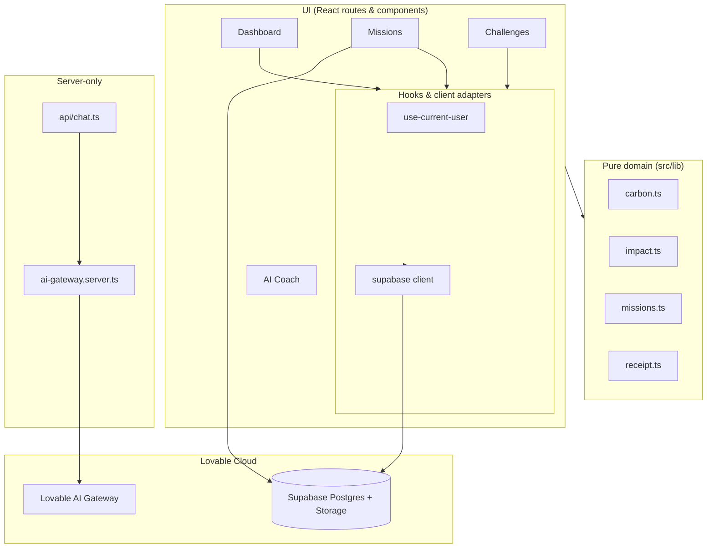

# Architecture

Carbon Coach follows a **clean-architecture** layering so that the business
rules (carbon math, mission generation, impact equivalents) never depend on
the framework, the database, or the browser.

## Layers

- **Pure domain (`src/lib/*.ts`)** — no I/O, no React imports. Fully unit-tested.
- **Server-only (`*.server.ts`, `routes/api/*`)** — runs in Workers runtime,
  imports secrets via `process.env`, never reaches the client bundle.
- **Hooks & client adapters** — thin wrappers around the typed Supabase client.
- **UI** — file-based routes under `src/routes/`. Authenticated routes live
  under `src/routes/_authenticated/` and are gated by the layout's
  `beforeLoad` redirect.

## Request lifecycle

1. User opens a route → TanStack Start matches the file, runs `beforeLoad`
   (auth gate), then the route loader.
2. Loader calls a server function or directly hits `supabase.from(...)` from
   the client (RLS enforces row-level access).
3. UI renders with TanStack Query data; mutations call `supabase` directly
   or use a `createServerFn` RPC for privileged work.
4. The AI Coach streams responses via `/api/chat` → Lovable AI Gateway → Gemini.

## Why these choices

- **TanStack Start** — file-based routing with SSR out of the box, type-safe
  loaders/params, no separate API server.
- **Supabase** under Lovable Cloud — managed Postgres, Auth, and Storage;
  RLS lets us put business rules where the data lives.
- **Pure functions for math** — every emission factor and recommendation is
  a unit test away from regression-free refactors.
