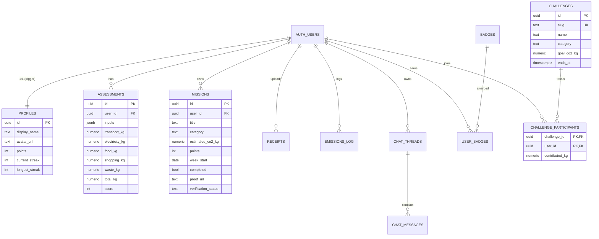

# Database schema

All tables live in the `public` schema with RLS enabled and `auth.uid()`
scoped policies (except curated read-only seeds and the safe leaderboard
RPC).

## Security-sensitive surfaces

| Object | Why | Access |
|---|---|---|
| `profiles` SELECT | leaderboard previously needed broad reads — now only own row | `auth.uid() = id` |
| `public.get_leaderboard()` | returns whitelisted public columns only | `authenticated` |
| `public.get_challenge_progress()` | aggregate counts only (no PII) | `authenticated` |
| `mission-proofs` storage bucket | private; folder = `auth.uid()` | own folder only |

See [SECURITY.md](./SECURITY.md) for the full threat model.
